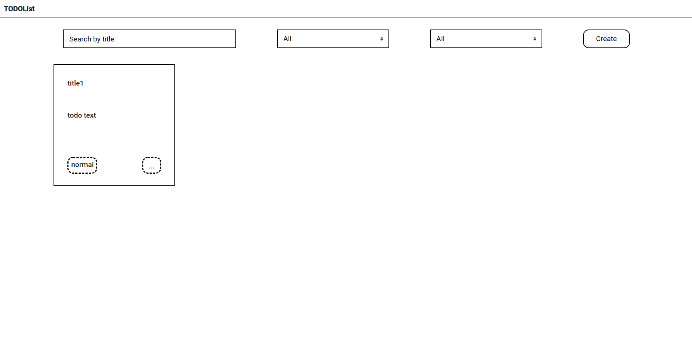
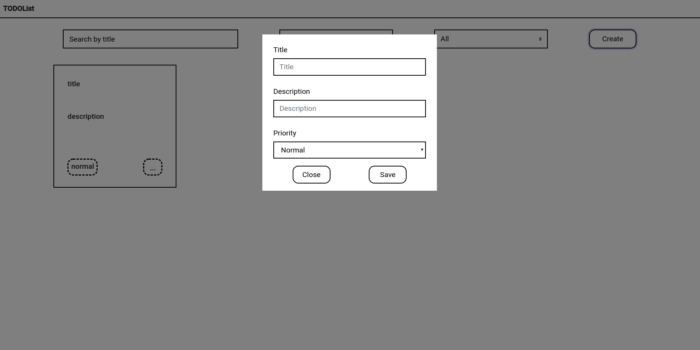

## toDoList

### Key Features

- Todo-list aplication includes next functionality:
  - Todo-item with a title, description, priority fields and a default status - open;
  - Edit all todo-item fields;
  - Move todo-item in done status;
  - Delete todo-item;
  - Search todo-item by title;
  - Filter todo-item by status;
  - Filter todo-item by priority.
- Use technologies:
  - Pure JavaScript ES6;
  - CSS preprocessor SCSS;

